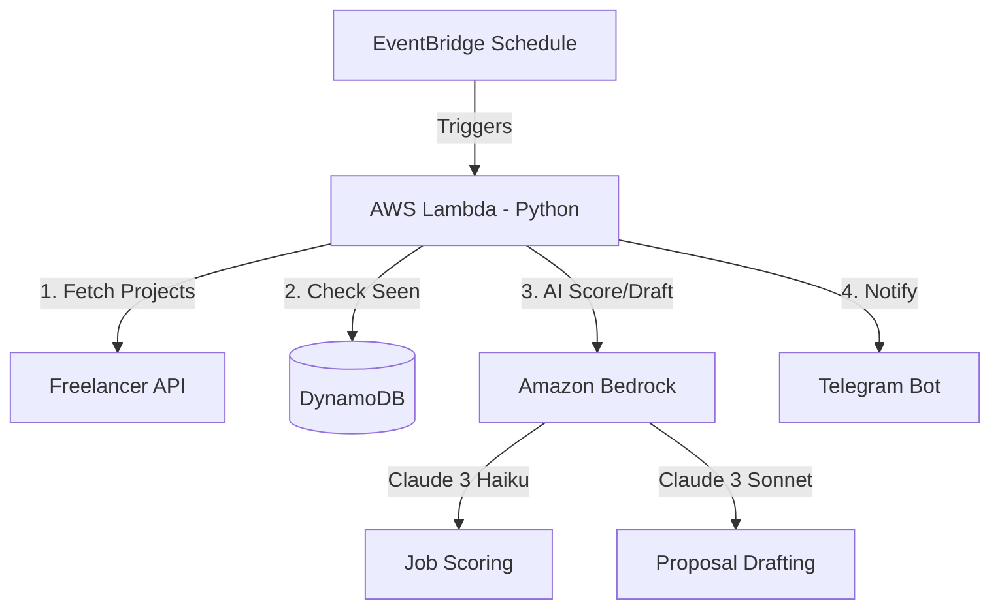

# 🚀 AI-Powered Freelancer Job Intelligence Bot

[](https://aws.amazon.com/)
[](https://www.python.org/downloads/)
[](https://aws.amazon.com/bedrock/)
[](https://core.telegram.org/bots)

A serverless automation system that monitors **Freelancer.com** for relevant job postings, filters them intelligently, scores them using AI (Claude 3), drafts tailored proposals, and notifies you via Telegram.

## 📌 Project Overview

This tool is designed for freelancers who want to stay ahead of the curve by receiving high-quality job leads directly to their phones. It automates the "search and filter" phase while keeping the "proposal submission" manual to remain compliant with platform policies and ensure high-quality human-in-the-loop interactions.

### 🧠 Key Capabilities
- **Live Monitoring**: Fetches jobs from Freelancer.com using official APIs.
- **Intelligent Filtering**: Filters by keywords, budget, and client verification status.
- **AI Scoring**: Uses **Claude 3 Haiku** to score jobs based on your specific profile.
- **Automated Drafting**: Generates professional proposal drafts using **Claude 3 Sonnet**.
- **Instant Notifications**: Sends rich Telegram alerts with job details and draft proposals.
- **Deduplication**: Ensures you never see the same job twice using DynamoDB.
- **Fully Serverless**: Zero maintenance, extremely low cost.

---

## 🏗️ Architecture

The system is built with a cloud-native, event-driven architecture on AWS.



---

## 🛠️ Infrastructure & Services

| Service | Purpose |
| :--- | :--- |
| **AWS Lambda** | Core execution engine (Python 3.9+) |
| **Amazon EventBridge** | Schedules the bot (e.g., every 10-15 minutes) |
| **DynamoDB** | State storage for job deduplication |
| **Amazon Bedrock** | GenAI for job evaluation and proposal writing |
| **Telegram Bot API** | Real-time notification delivery |

---

## 🔐 Configuration

Configuring the bot is done entirely through **Lambda Environment Variables**. No code changes are required for customization.

### 🔹 Core API Keys
| Variable | Description |
| :--- | :--- |
| `FL_ACCESS_TOKEN` | [Freelancer.com OAuth Token](https://www.freelancer.com/api-key) (Read-only) |
| `TELEGRAM_BOT_TOKEN` | Token from [@BotFather](https://t.me/botfather) |
| `TELEGRAM_CHAT_ID` | Your Chat ID (Get it from [@userinfobot](https://t.me/userinfobot)) |

### 🔹 Filtering & AI Controls
| Variable | Example Value | Description |
| :--- | :--- | :--- |
| `JOB_KEYWORDS` | `react, node, aws, python` | Skills to search for |
| `MIN_BUDGET` | `50` | Minimum job budget in USD |
| `REQUIRE_PAYMENT_VERIFIED` | `true` | Skip unverified clients |
| `AI_SCORE_THRESHOLD` | `70` | Minimum score (0-100) to notify |
| `YOUR_PROFILE_SUMMARY` | `Expert full-stack...` | Context for AI proposal drafting |

---

## 🚀 Deployment Guide

### 1. AWS IAM Setup
The Lambda function requires a role with the following policy:

```json
{
  "Version": "2012-10-17",
  "Statement": [
    {
      "Effect": "Allow",
      "Action": [
        "dynamodb:GetItem",
        "dynamodb:PutItem",
        "dynamodb:UpdateItem"
      ],
      "Resource": "arn:aws:dynamodb:*:*:table/freelancer_jobs"
    },
    {
      "Effect": "Allow",
      "Action": "bedrock:InvokeModel",
      "Resource": "*"
    }
  ]
}
```

### 2. DynamoDB Table
Create a table named `freelancer_jobs` with:
- **Partition Key**: `project_id` (String)
- **Billing Mode**: On-demand (Recommended for lowest cost)

### 3. Lambda Deployment
1. Create a Python 3.9+ Lambda function.
2. Upload `main.py`.
3. Configure the environment variables listed above.
4. Set the timeout to at least 30 seconds (AI calls can be slow).

### 4. EventBridge Trigger
Add a CloudWatch Event / EventBridge trigger to run the function on a schedule (e.g., `rate(10 minutes)`).

---

## 🛡️ Security & Ethics
- **Read-Only**: The bot only reads job postings. It cannot place bids or spend money.
- **TOS Compliant**: By keeping the final submission manual, you adhere to platform terms of service regarding automation.
- **Secret Management**: Highly sensitive keys should ideally be moved to **AWS Secrets Manager** for production use.
- **Cost Controlled**: Bedrock calls only happen for jobs that pass initial keyword/budget filters.

## 📄 License
This project is for personal productivity and educational purposes. Use responsibly.
